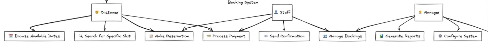

## What is Requirement Analysis?
Requirement Analysis is a critical phase in the Software Development Life Cycle (SDLC) that involves gathering, understanding, and documenting the needs and expectations of stakeholders for a software system. It serves as the foundation for successful software development by ensuring that all parties have a clear understanding of what needs to be built.

## Why is Requirement Analysis Important?
1. **Reduces Development Costs**: Early identification of requirements helps prevent expensive changes later in development.
2. **Ensures Project Success**: Clear requirements lead to better alignment between stakeholder expectations and final deliverables.
3. **Improves Quality**: Well-defined requirements enable better testing and validation of the final product.
4. **Minimizes Risks**: Thorough analysis helps identify potential challenges and constraints early in the project.

## Key Activities in Requirement Analysis
* **Requirement Gathering**
  - Collecting raw requirements from stakeholders
  - Conducting interviews and surveys
  - Reviewing existing documentation
  
* **Requirement Elicitation**
  - Extracting detailed information from stakeholders
  - Clarifying ambiguous requirements
  - Identifying hidden requirements
  
* **Requirement Documentation**
  - Creating formal requirement specifications
  - Writing user stories and use cases
  - Maintaining requirement traceability
  
* **Requirement Analysis and Modeling**
  - Creating visual models and diagrams
  - Analyzing feasibility and constraints
  - Identifying dependencies and relationships
  
* **Requirement Validation**
  - Verifying requirements with stakeholders
  - Ensuring requirements are complete and consistent
  - Validating technical feasibility

## Types of Requirements

### Functional Requirements
Requirements that specify what the system should do:
* User registration and authentication
* Booking creation and management
* Payment processing
* Notification system
* Search and filter functionality

### Non-functional Requirements
Requirements that specify how the system should perform:
* Performance: System should handle 1000 concurrent users
* Security: Data encryption and secure authentication
* Usability: Interface should be mobile-responsive
* Reliability: 99.9% uptime
* Scalability: Ability to handle growing user base

## Use Case Diagrams
Use Case Diagrams are visual representations of how users (actors) interact with the system. They help in understanding system functionality from an external perspective.

Benefits:
* Provides clear visualization of system functionality
* Helps identify all system users and their roles
* Facilitates communication between stakeholders

## Acceptance Criteria
Acceptance Criteria define the conditions that must be met for a requirement to be considered complete and acceptable.

### Example: Checkout Feature Acceptance Criteria
1. User must be logged in to access checkout
2. System must validate payment information
3. Confirmation email must be sent after successful booking
4. Booking details must be stored in the database
5. User must be able to view booking confirmation page
6. System must handle payment failures gracefully
